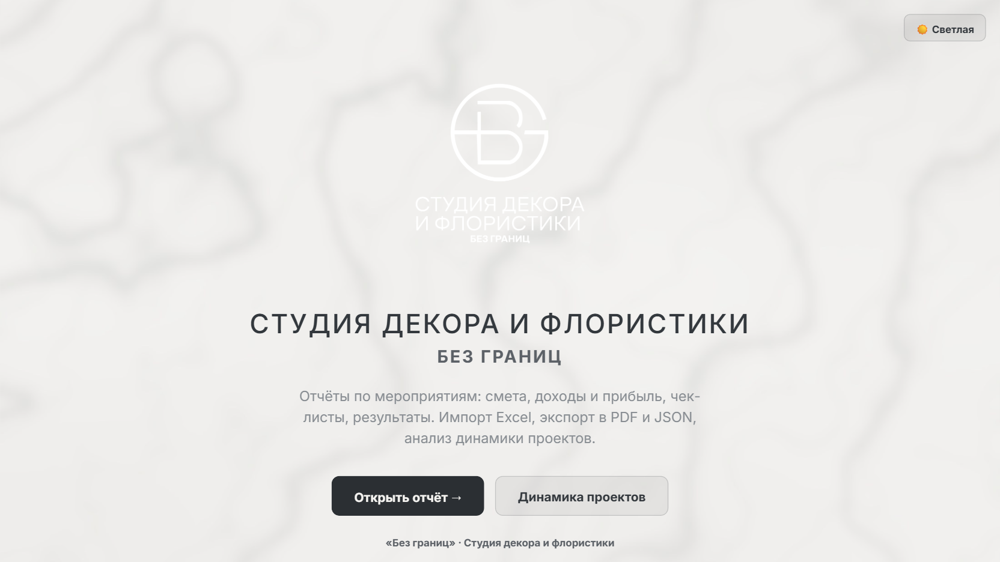
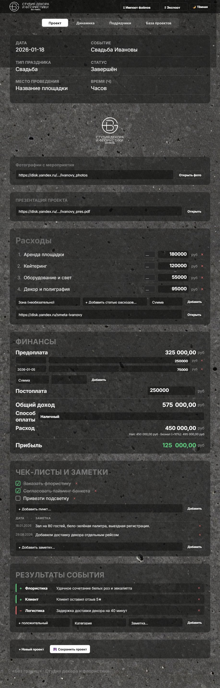
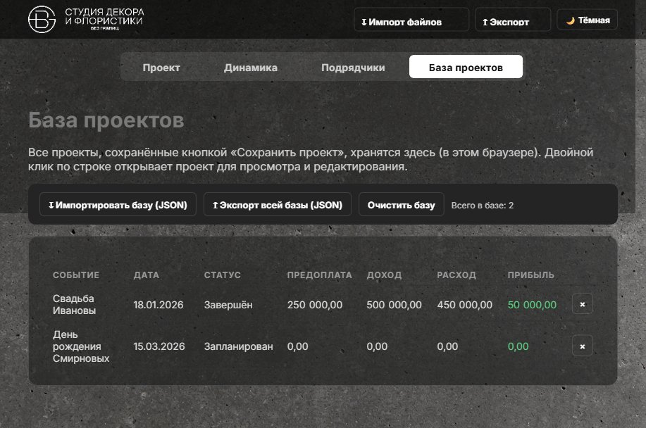
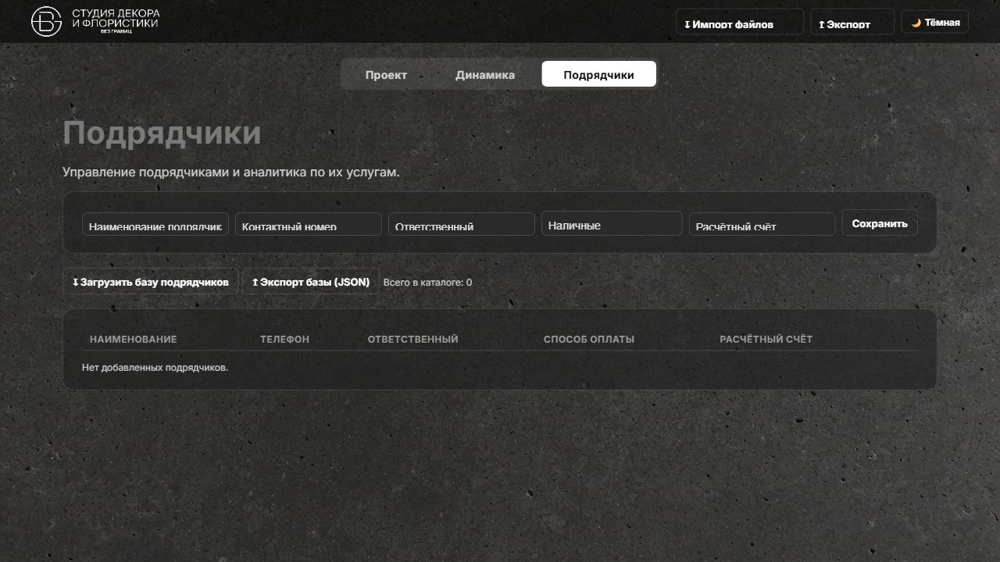

# «Без границ» — Отчёт по мероприятию

Веб-приложение для студии декора и флористики: ведение отчёта по мероприятию
(смета, доходы и прибыль, чек-листы, заметки, результаты, фото, презентация),
база сохранённых проектов, анализ динамики по нескольким проектам и справочник
подрядчиков.

Работает полностью локально, в браузере, без установки и без базы данных.
Все данные хранятся в вашем браузере (localStorage) и в файлах, которые вы
сохраняете себе на компьютер.

> 📄 Подробное руководство по каждой вкладке, что можно редактировать, как
> правильно сохранять проекты и как не потерять данные — см. отдельный
> Word-документ **«Инструкция — Без границ.docx»**, который идёт вместе с
> этим архивом. Здесь — только краткий обзор и технический запуск.

---

## 0. С чего начать при первом открытии

При самом первом открытии страница полностью пустая: нет ни одного сохранённого
проекта, нет базы подрядчиков — переключатель вкладок наверху ещё даже не
виден. Это не ошибка: он специально скрыт, пока в отчёте и в базе совсем ничего
нет, и появляется, как только вы заполните хоть одно поле.

1. **Впишите что-нибудь в шапку мероприятия** (вкладка «Проект» открыта по
   умолчанию) — например, дату или название. Переключатель вкладок сразу
   появится.
2. **Внесите своих подрядчиков** — вкладка «Подрядчики» → форма вверху
   (название, телефон, ответственный, способ оплаты, счёт) → «Сохранить».
   База пока пустая — заводите реальных подрядчиков студии, не обязательно
   всех сразу.
3. **Заполните первый проект** — смета, финансы, чек-лист, заметки, результаты.
4. **Сохраните проект** — кнопка «💾 Сохранить проект» внизу вкладки. Он
   появится в «Базе проектов».
5. **Для следующего мероприятия** — «+ Новый проект» → заполните → «Сохранить
   проект».
6. Как только в базе окажется **2 и более проектов** — вкладка «Динамика»
   сама начнёт показывать сводную аналитику.

Подробнее и с пояснениями — раздел 2 в Word-инструкции.

---

## 1. Как запустить

### Способ А — двойной клик (проще всего)

Откройте файл **`index.html`** двойным кликом — он откроется в браузере
по умолчанию (Chrome, Edge, Yandex Browser и т.п.).

Это самый простой вариант, и в нём работает всё, **кроме** экспорта в
Excel и PDF (см. пункт про интернет ниже).

### Способ Б — через локальный сервер (рекомендуется для полноценной работы)

Так экспорт в Excel и PDF гарантированно работает без сюрпризов браузера
по безопасности локальных файлов.

Если на компьютере установлен **Python**:

```bash
cd путь_до_папки/beta-release
python -m http.server 8080
```

Затем откройте в браузере: `http://localhost:8080/index.html`

Если установлен **Node.js**:

```bash
cd путь_до_папки/beta-release
npx serve .
```

и открыть адрес, который выведет команда.

> Если непонятно, что такое «терминал» и как в него зайти — это можно
> один раз настроить с айтишником, а дальше просто открывать браузер по
> ссылке. Способ А (двойной клик) при этом всё равно можно использовать
> для повседневной работы — просто держите в уме про экспорт (ниже).

### ⚠️ Про интернет

Приложение не требует сервера и работает офлайн, **но**:

- Экспорт в **Excel** и **PDF**, а также графики в «Динамике» — используют
  библиотеки, которые подгружаются из интернета при каждом открытии страницы.
  Без интернета эти три функции не заработают, всё остальное — заработает.
- Экспорт в **JSON** и импорт JSON/Excel/CSV, чек-листы, заметки, результаты,
  подрядчики, «База проектов» — работают полностью офлайн.

### ⚠️ Если страница открылась «без оформления»

При первом открытии (особенно сразу после скачивания/распаковки) страница
иногда на пару секунд показывается совсем без стилей — обычно это антивирус
проверяет файлы. Приложение само это отслеживает: наверху появится
предупреждение и обычно само исчезает через несколько секунд. Если не исчезло —
просто обновите страницу (F5).

---

## 2. Что внутри пакета

```
beta-release/
├── Инструкция — Без границ.docx — подробное руководство (вкладки, редактирование,
│                                  сохранение проектов, как не потерять данные)
├── index.html               — стартовая страница (обложка)
├── report.html               — страница отчёта по мероприятию
├── styles.css, app.js        — оформление и логика (не нужно открывать/менять)
├── logo*.png                — логотип
├── background.png            — фон тёмной темы
├── background-light.jpg      — фон светлой темы
├── contractors-base.json/.js — ТЕСТОВЫЙ набор из 128 демо-подрядчиков (для проверки)
├── sample-data/               — несколько примеров отчётов и одна смета
│                                для быстрого тестирования
├── test-data-v2/              — 20 готовых тестовых мероприятий (для
│                                демонстрации режима «Динамика»/«Базы проектов»)
└── screenshots/                — картинки к этой инструкции
```

Внутри ничего запускать/устанавливать не нужно — просто открываете
`index.html`.

---

## 3. Обзор интерфейса

### Стартовая страница



Две кнопки: **«Открыть отчёт»** — переход к текущему/новому мероприятию,
**«Динамика проектов»** — переход сразу в аналитику по нескольким
мероприятиям.

### Страница отчёта («Проект»)



Наверху — вкладки-переключатель: **Проект / Динамика / Подрядчики / База
проектов** (появляется, как только в отчёте (или в базе) есть хоть какие-то
данные).

**Шапка мероприятия** — дата, название, тип праздника, статус, место
проведения, продолжительность в часах.

**Фото и презентация** — просто вставьте ссылку (Яндекс.Диск, Google
Photos, облако с презентацией) — само мероприятие не хранит файлы, только
ссылки на них. Рядом с каждой ссылкой — кнопка **«Открыть»**, ведёт по ссылке
в новой вкладке.

**Расходы (смета)** — можно:
- добавлять статьи расходов вручную (зона мероприятия, название, сумма);
- импортировать готовую смету из Excel/CSV кнопкой **«↧ Импорт файлов →
  Смета»** — приложение само распознаёт зоны, количество/цену, способ
  оплаты и наценку за безнал, если они есть в файле;
- внизу блока — своя ссылка на смету (Excel/Google Sheets/Диск) с кнопкой
  «Открыть», не зависит от импорта.

**Финансы** — **предоплата вносится несколькими платежами** (сумма + дата
у каждого, дату можно проставить/поправить позже), постоплата, способ оплаты
(наличный/безналичный с наценкой) — доход/расход/прибыль считаются
автоматически.

**Чек-листы** — список задач с галочками. **Заметки** — отдельная таблица:
можно добавить сколько угодно записей, дата у каждой проставляется
автоматически.

**Результаты события** — положительные и отрицательные итоги по категориям
(например: «Флористика» — «+», «Логистика» — «−»).

**Внизу страницы** — кнопки **«+ Новый проект»** и **«💾 Сохранить проект»**
(подробно — в Word-инструкции).

### Экспорт и импорт

Кнопка **«↥ Экспорт»** в топбаре:
- **JSON** — полная копия отчёта, можно передать коллеге или загрузить
  обратно позже (работает офлайн);
- **Excel** — смета/финансы в оформленном виде, с той же структурой, что
  и исходные файлы студии (нужен интернет);
- **PDF** — красиво оформленная версия отчёта «как на экране», с тем же
  фоном/темой, что выбрана в этот момент на странице (нужен интернет).

Кнопка **«↧ Импорт файлов»** — обратная операция: загрузить JSON-отчёт или
смету Excel/CSV.

### База проектов



Все проекты, сохранённые кнопкой «Сохранить проект», хранятся здесь (в этом
браузере) в виде таблицы: Событие, Дата, Статус, Предоплата, Доход, Расход,
Прибыль. **Двойной клик по строке** открывает проект во вкладке «Проект» для
просмотра и редактирования — повторное сохранение обновит ту же запись, а не
создаст дубликат. Кнопка «×» в конце строки удаляет проект из базы.

Сверху — **«↧ Импортировать базу (JSON)»** (можно выбрать сразу несколько
файлов разом) и **«↥ Экспорт всей базы (JSON)»** — один файл со всеми
проектами, удобно для резервной копии или переноса на другой компьютер.
«Очистить базу» удаляет всё (с подтверждением) — используйте после того, как
выгрузили копию.

### Динамика проектов

Если в «Базе проектов» сохранено ≥2 проектов — «Динамика» **автоматически**
подставляет данные из базы, ничего загружать вручную не нужно. Рядом с
таблицей появляется список с галочками «Все проекты базы ▾» — можно снять
галочки и оставить один-два конкретных проекта, чтобы увидеть динамику только
по ним. Кнопка «↧ Загрузить отчёты (JSON)» по-прежнему работает отдельно —
для разовых файлов, которых нет в базе.

Появятся таблица по всем мероприятиям, KPI (доход/расход/прибыль) и графики.
**Если среди выбранных проектов есть разные года** (например, 2025 и 2026) —
график «Прибыль по месяцам» сначала показывает свёрнутый вид **«Прибыль по
годам»**: клик по столбцу года раскрывает месяцы именно этого года, кнопка
«← Вернуться к графику годов» возвращает обратно.

Для быстрой демонстрации возьмите файлы из папки `test-data-v2/` — это
20 готовых мероприятий, разбитых по типам праздника.

### Подрядчики



Справочник подрядчиков: название, контакты, ответственный, способ оплаты,
расчётный счёт. Основной способ его наполнить — форма вверху вкладки: вносите
реальных подрядчиков студии по одному, кнопкой «Сохранить». Подрядчиков,
привязанных к конкретному мероприятию (в смете), можно посмотреть в аналитике
по категориям услуг.

> ⚠️ Кнопка «↧ Загрузить базу подрядчиков» подгружает **тестовый** набор из
> 128 демо-подрядчиков (файл `contractors-base.json`/`.js`) — он нужен только
> для проверки интерфейса, реальных подрядчиков студии там нет. В обычной
> работе эта кнопка не нужна.

### Тема оформления

Кнопка **«🌙 Тёмная / ☀️ Светлая»** в правом верхнем углу (есть и на
стартовой странице, и на странице отчёта) переключает фон между тёмным
и светлым (мраморным) оформлением. Выбор запоминается в браузере и
одинаков на обеих страницах. Экспортированный PDF всегда выглядит так же,
как активная в этот момент тема на экране.

---

## 4. Частые вопросы

**Не открывается Excel/PDF экспорт, пишет ошибку.**
Скорее всего, нет интернета в момент открытия страницы — эти два формата
подгружают библиотеки с CDN. Проверьте соединение и обновите страницу.

**«Не удалось загрузить базу» при загрузке подрядчиков.**
Убедитесь, что файл `contractors-base.js` лежит в той же папке, что и
`report.html` — он не должен быть отдельно перемещён или удалён.

**Чем «Сохранить проект» отличается от того, что данные и так вроде не
пропадают при перезагрузке страницы?**
Это два разных механизма. Автосохранение в браузере хранит только ТЕКУЩИЙ,
последний открытый проект — оно молча перезаписывается, как только вы
начинаете новый. «Сохранить проект» кладёт копию в постоянную «Базу
проектов», где одновременно живут все ваши мероприятия. Подробно — в
Word-инструкции, раздел «Как правильно сохранять проекты».

**Данные пропали после закрытия браузера / очистки истории.**
Данные хранятся в браузере конкретного компьютера (localStorage) — это
касается и текущего отчёта, и «Базы проектов». Чтобы не потерять важные
проекты — регулярно нажимайте «Сохранить проект» и время от времени
выгружайте всю базу («↥ Экспорт всей базы (JSON)») себе в облако/на диск.

**Как передать отчёт коллеге или перенести на другой компьютер?**
Один проект — «↥ Экспорт → JSON» во вкладке «Проект». Всю базу целиком —
«↥ Экспорт всей базы (JSON)» во вкладке «База проектов». Коллега открывает
этот же сайт и загружает файл через соответствующую кнопку импорта.

**Можно ли редактировать несколько мероприятий одновременно в разных
вкладках браузера?**
Нет, страница отчёта всегда работает с одним «текущим» мероприятием. Чтобы
вести несколько параллельно — сохраните текущее («Сохранить проект»), затем
нажмите «+ Новый проект» и начинайте следующее.

---

По техническим вопросам и доработкам — обращайтесь к разработчику.
